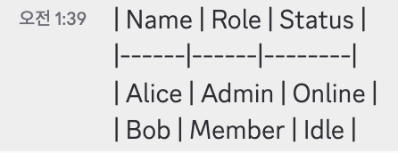
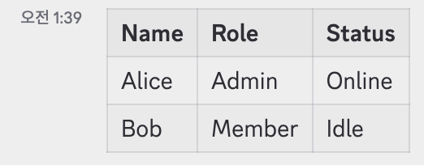

# MarkdownTableRenderer

A [Shelter](https://github.com/uwu/shelter) plugin that renders Markdown tables in Discord messages.

## Before / After

| Before | After |
|--------|-------|
|  |  |

## Installation

Open Shelter settings → **Plugins → Add Plugin** and paste the URL:

```
https://ajchemist.github.io/shelter-plugins/MarkdownTableRenderer/
```

## Verification

Paste this message in Discord to confirm rendering:

```md
before
| Name | Role | Status |
|------|------|--------|
| Alice | Admin | Online |
| Bob | Member | Idle |
after
```

## Development

Requirements: [pnpm](https://pnpm.io), Node.js 18+

```sh
pnpm i
pnpm lune ci          # build → dist/
pnpm lune ssg ci      # generate site → dist/
node test-port.js     # smoke test
```

## Acknowledgements

[leavingme/MarkdownTableRenderer](https://github.com/leavingme/MarkdownTableRenderer) — heavily referenced during development of this plugin.
